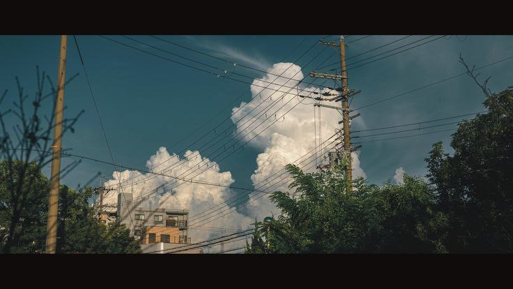

---

 

# ~ О прекрасной мне <333

 

---

&nbsp;&nbsp;&nbsp;&nbsp;&nbsp;&nbsp;&nbsp;&nbsp;&nbsp;&nbsp;&nbsp;&nbsp;&nbsp;&nbsp; 

 

<h3> Халёу🌟! Я Пак Александра, прилежная ученица университета ИТМО на программе нейротехнологии и программирование и по совместительству яркий и творческий человечек, который пока еще грызет гранит науки в ИТМО.💫 На этом сайте я собрала свои проекты и лабораторные работы. Заходите в гости, буду рада!✨ </h3>

---

# ~ Мои ценности ^-^
<h3> 💥 Быстро учусь </h3> 
<h3> 💗 Неплохо лажу с людьми </h3> 
<h3> ☀️ Я сама </h3> 

---

# ~ Мои увлечения:
<h3> 🎨 Рисование </h3> 
<h3> 🖥 Программирование </h3> 
<h3> ☕️ Чай </h3> 
<h3> ✨ Звёздочки  </h3> 

---

# ~ Связаться со мной:
<h3> 🌿 Email: sanhespak@gmail.com </h3>
<h3> 🌼 Telegram: @SaNheS_UwU <h3>

